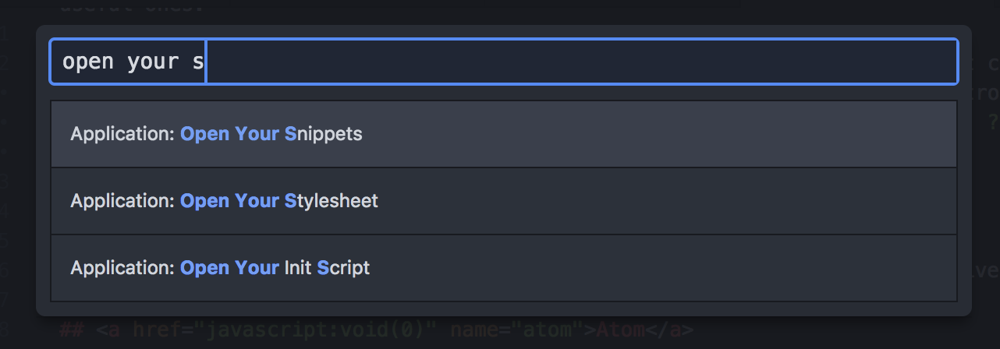

Snippets are an underappreciated feature of code editors, which can increase your typing speed when writing code. Snippets provide autocompletion for common chunks of code. Type a few characters, then hit tab or enter, and the snippet expands into the full code block required.

Most code editors come with a variety of built-in snippets covering common syntax. For example, typing the word `log` and enter from within a JavaScript file in Atom will expand into our trusty friend, `console.log("")`. However, if you’re using an editor other than PHPStorm to work with Magento, you may find yourself missing some useful ones. This is especially true in template files (`.phtml` filetypes).

Recently I’ve been working on a new feature that required a lot of new text content. I was repeatedly typing the template method to translate text. So to save myself time and keystrokes, I created a snippet for this pattern. Now instead of typing `<?php echo $this->__('Text to translate.'); ?>` "by hand", I only need to type `__` and hit tab to make the value appear.


Here’s how I did this, for in the Atom text editor.

## Atom

Atom's core `language-` packages all include built-in snippets. Custom user snippets for different file types are stored in a single `snippets.cson` file. To open this file, open the command palette (Cmd + Shift + P on Mac) and select the “Application: Open Your Snippets” command. Or, from the menu bar in Mac, open the main Atom menu and select the `Snippets` option.



You can also access this file directly at `~/.atom/snippets.cson`. The comments show an example snippet and a link to the [official documentation](http://flight-manual.atom.io/using-atom/sections/snippets/). This will explain the definition of each property to use in the Coffeescript object.

The difficulty with snippets is knowing the correct file scope to use. Since Magento template files are the `.phtml` filetype, they contain both PHP and HTML scope. Luckily there's a method within Atom to discover the scope you need .

Open a file in which you want the snippet to be available, and place the cursor in the correct location. Note that scope can vary within a file. For example, if you want the snippet to be available within a `<?php ... ?>` block, place the cursor within a block, and not outside it. Open the command palette and select the `Editor: Log Cursor Scope` command. A notification will appear, showing a list of scopes available. The one required for the snippet should be the top one.

For my case, I want the snippet to be available within `.phtml` template files, whilst typing HTML. So the scope I need is `.text.html.php` (and not `.source.php` or `.text.html.basic` as I had guessed!).

When you save your snippet, Atom will automatically reload them and they should be available immediately in your active text editor (if the syntax is correct!). My final result was this:

```coffeescript
'.text.html.php':
  'translate':
    'prefix': '__'
    'body': '<?php echo $this->__(\'${1}\'); ?>'
```

All I do is type two underscores, hit either tab or enter, and the snippet appears on screen with my cursor focussed at the `${1}` location. Just what I wanted!

The next time you find yourself typing the same chunk of code repeatedly, think about how you could streamline your process with a snippet instead.
